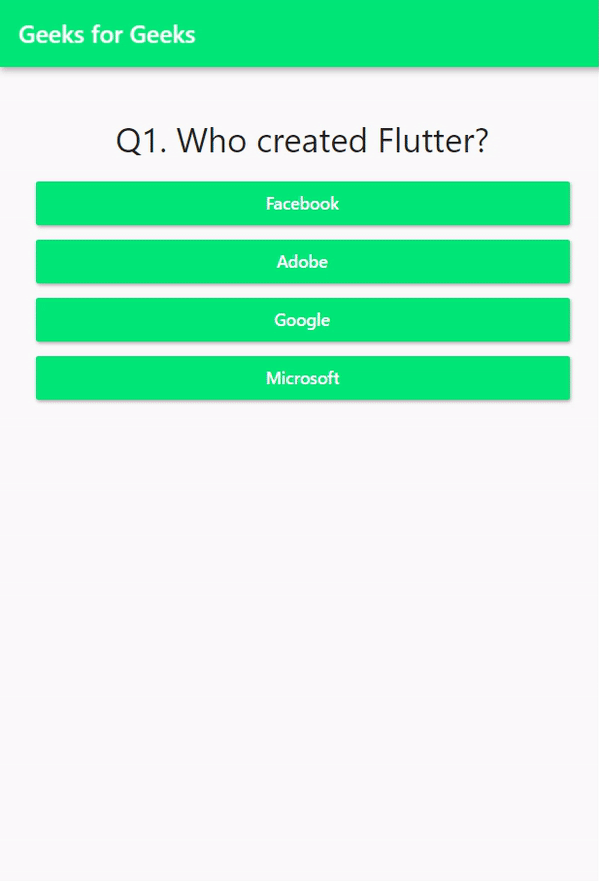

# quizapp

Application de quiz de base dans l'API Flutter
By Geeks for Geeks [ Dernière mise à jour : 03 avril 2024 ]

---

Flutter API est un kit de développement logiciel open source permettant de créer de belles interfaces utilisateur compilées en mode natif. Il est actuellement disponible en version stable pour les systèmes d'exploitation iOS et Android.

Dans cette application, nous aurons les fonctionnalités ou modules mentionnés ci-dessous :

Cinq questions à choix multiples (d'autres questions peuvent être ajoutées).
Quatre options sélectionnables pour chaque question sous forme de boutons sauf la dernière.
Le score sera calculé en fonction de l'option sélectionnée pour chaque question (en interne).
Et en fonction du score final, une remarque sera affichée à la fin du quiz en plus du score et du bouton de redémarrage.
Il y a deux écrans dans l'accueil de l'application (où les questions seront affichées) et l'écran de résultats (où le score et la remarque seront affichés).
L'ensemble de l'application sera séparé en cinq modules différents, à savoir main.dart, question.dart, answer.dart, quiz.dart et result.dart.

---

## Getting Started

This project is a starting point for a Flutter application.

A few resources to get you started if this is your first Flutter project:

- [Lab: Write your first Flutter app](https://docs.flutter.dev/get-started/codelab)
- [Cookbook: Useful Flutter samples](https://docs.flutter.dev/cookbook)

For help getting started with Flutter development, view the
[online documentation](https://docs.flutter.dev/), which offers tutorials,
samples, guidance on mobile development, and a full API reference.
